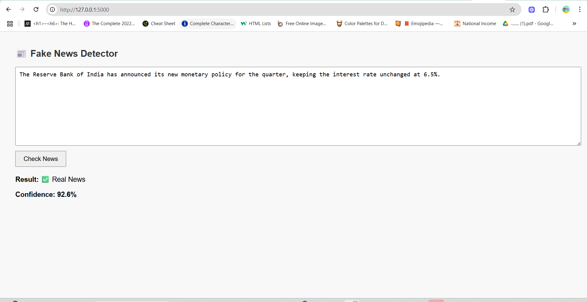

# 📰 Fake News Detector

This is a machine learning web app built with Flask that detects whether a news article is real or fake using a Naive Bayes model trained on Kaggle's dataset.

## 🔧 Technologies Used
- Python
- Flask
- Scikit-learn
- TF-IDF
- HTML/CSS (Jinja templates)


## 🚀 How to Run
1. Clone this repo
2. Install dependencies: `pip install -r requirements.txt`
3. Run: `python app.py`
4. Go to `http://127.0.0.1:5000`

## 📂 Folder Structure

```
fake-news-detector/
├── app.py                  # Flask web app
├── train_model.py          # ML training script
├── model/
│   ├── fake_news_model.pkl # Trained classifier
│   └── vectorizer.pkl      # TF-IDF vectorizer
├── dataset/
│   ├── Fake.csv            # Fake news data
│   └── True.csv            # Real news data
├── templates/
│   └── index.html          # Frontend UI template
├── requirements.txt        # Dependencies
├── README.md               # Project documentation
```
